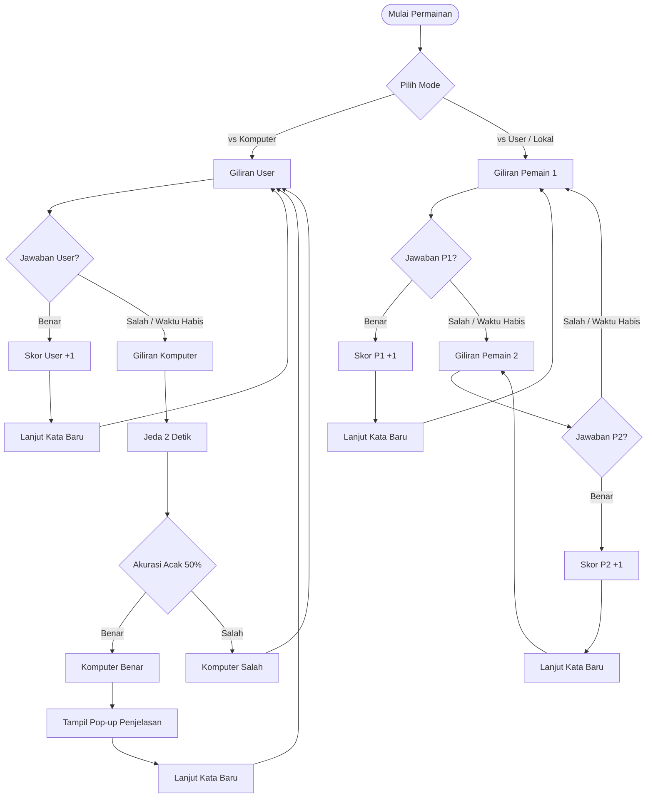

# Rencana Implementasi: 2 Mode Permainan Word Scramble (Fase 5)

Rencana ini menjelaskan alur logika dan implementasi teknis untuk mode **Pemain vs Komputer** dan **Pemain vs Pemain (Lokal)**. Mode Multiplayer ditunda terlebih dahulu.

## Alur Logika Permainan

---

## Proposed Changes

### Word Scramble Gameplay Component (Livewire)

#### [MODIFY] [ScramblePlay.php](file:///c:/laragon/www/terjemah_gambar/app/Http/Livewire/ScramblePlay.php)
- State variable baru:
  - `$gameMode`: `'vs_computer'` atau `'vs_user'`.
  - `$currentTurn`: `'user'`, `'computer'`, `'player1'`, atau `'player2'`.
  - `$player1Score` & `$player2Score` (untuk mode `vs_user`).
  - `$computerScore` (untuk mode `vs_computer`).
- Method `computerTurn()`:
  - Dipicu secara otomatis setelah jeda 2 detik jika giliran berpindah ke komputer.
  - Komputer menjawab secara acak (akurasi 50%). Jika benar, komputer mendapatkan poin dan lanjut ke kata baru. Jika salah, giliran dikembalikan ke user pada kata yang sama.
- Menyesuaikan method `submitAnswer()`:
  - Validasi berdasarkan mode permainan dan ganti giliran jika jawaban salah.

#### [MODIFY] [scramble-play.blade.php](file:///c:/laragon/www/terjemah_gambar/resources/views/livewire/scramble-play.blade.php)
- Halaman pilihan Mode (vs Komputer atau vs User Lokal) sebelum memulai game.
- Papan indikator status giliran yang aktif ("Giliran: Pemain 2" atau "Komputer sedang menjawab...").
- Tampilan skor masing-masing pihak secara real-time.

## Verification Plan

### Manual Verification
- Uji coba mode **vs Komputer**: Jawab salah secara sengaja, pastikan giliran berpindah ke komputer, ada jeda 2 detik, dan komputer menjawab secara otomatis.
- Uji coba mode **vs User**: Mainkan dua orang secara bergantian, pastikan giliran berpindah dari Pemain 1 ke Pemain 2 saat salah menjawab.
