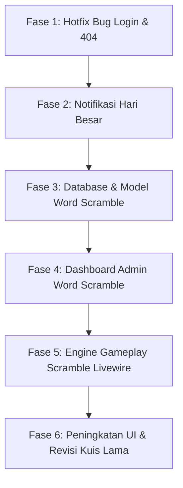

# Rencana Implementasi Terstruktur: Fitur Baru, Bug Fix & Revisi

Dokumen ini menjelaskan urutan langkah kerja terperinci yang mencakup database, model, controller, komponen Livewire, dan integrasi UI untuk projek **`terjemah_gambar`**.

## Alur Pengerjaan (Urutan Logis)



---

## Rincian Teknis & Rencana Perubahan File

### FASE 1: Hotfix Bug Login & 404

#### 1. Perbaikan Bug Login Instan
* **File:** [RedirectIfAuthenticated.php](file:///C:/laragon/www/terjemah_gambar/app/Http/Middleware/RedirectIfAuthenticated.php)
* **Tindakan:** Hapus `dd($role);` pada baris ke-23 agar admin dan user dapat masuk ke dashboard tanpa di-blokir oleh dump debug.

#### 2. Merapikan Middleware Routing
* **File:** [web.php](file:///C:/laragon/www/terjemah_gambar/routes/web.php)
* **Tindakan:** Pastikan rute yang membutuhkan login dibungkus dalam middleware `auth` sebelum memanggil check role, untuk mencegah error 404 / 403 saat session habis.

---

### FASE 2: Fitur Notifikasi Hari Besar (Homepage)

#### 1. Migrasi Database Notifikasi
* **File Baru:** `database/migrations/xxxx_xx_xx_create_holiday_notifications_table.php`
* **Skema:**
  ```php
  Schema::create('holiday_notifications', function (Blueprint $table) {
      $table->id();
      $table->string('name'); // Nama hari besar (contoh: "Hari Raya Idul Fitri")
      $table->date('start_date'); // Tanggal mulai tayang
      $table->date('end_date'); // Tanggal akhir tayang
      $table->string('icon_type'); // Jenis ikon (ketupat, merdeka, bintang, dll)
      $table->integer('display_duration')->default(5); // Durasi tampil (detik)
      $table->timestamps();
  });
  ```

#### 2. Model & Admin Controller
* **File Baru:** `app/Models/HolidayNotification.php`
* **File Baru:** `app/Http/Controllers/Dashboard/HolidayNotificationController.php` (Pengelolaan CRUD untuk admin).
* **View Baru:** `resources/views/admin/holiday/index.blade.php` (Form admin untuk set tanggal & ikon).

#### 3. Tampilan Homepage (Autohide 5 Detik)
* **File:** [welcome.blade.php](file:///C:/laragon/www/terjemah_gambar/resources/views/welcome.blade.php)
* **Tindakan:** Load notifikasi yang aktif hari ini. Jika ada, tampilkan overlay animasi ikon menggunakan Tailwind/CSS & JS dengan timer `setTimeout` untuk sembunyikan otomatis dalam 5 detik.

---

### FASE 3: Database & Model Game Word Scramble

#### 1. Migrasi Kata & Detail Pop Up
* **File Baru:** `database/migrations/xxxx_xx_xx_create_scramble_words_table.php`
* **Skema:**
  ```php
  Schema::create('scramble_words', function (Blueprint $table) {
      $table->id();
      $table->string('word'); // Kata dasar (misal: "BANANA")
      $table->text('description'); // Penjelasan pop up detail dikelola admin
      $table->enum('level', ['beginner', 'intermediate', 'advanced']);
      $table->timestamps();
  });
  ```

#### 2. Migrasi Pengaturan Global (Background & Musik Latar)
* **File Baru:** `database/migrations/xxxx_xx_xx_create_scramble_settings_table.php`
* **Skema:**
  ```php
  Schema::create('scramble_settings', function (Blueprint $table) {
      $table->id();
      $table->string('wetland_bg')->nullable(); // File path gambar lahan basah
      $table->string('bg_music')->nullable(); // File path musik latar
      $table->integer('timer_seconds')->default(30); // Batas waktu menjawab kuis
      $table->integer('unlock_beginner_target')->default(20); // Target jumlah benar untuk lanjut level 2
      $table->integer('unlock_intermediate_target')->default(20); // Target jumlah benar untuk lanjut level 3
      $table->timestamps();
  });
  ```

#### 3. Migrasi Riwayat Permainan (Score & Unlock Player)
* **File Baru:** `database/migrations/xxxx_xx_xx_create_scramble_attempts_table.php`
* **Skema:**
  ```php
  Schema::create('scramble_attempts', function (Blueprint $table) {
      $table->id();
      $table->foreignId('user_id')->constrained()->onDelete('cascade');
      $table->string('mode'); // vs_computer, vs_user, multiplayer
      $table->integer('score');
      $table->integer('correct_count');
      $table->timestamps();
  });
  ```

---

### FASE 4: Pengelolaan Admin untuk Word Scramble

#### 1. Controller CRUD Word Scramble
* **File Baru:** `app/Http/Controllers/Dashboard/ScrambleController.php`
* **Fitur:**
  * Tambah/Edit/Hapus kata acak beserta deskripsinya dan tingkat kesulitan.
  * Halaman upload musik MP3 & gambar background Wetland.
  * Pengaturan target unlock level & durasi timer per soal.

#### 2. View Admin
* **File Baru:** `resources/views/admin/scramble/index.blade.php` & `resources/views/admin/scramble/settings.blade.php`.

---

### FASE 5: Pembuatan Game Word Scramble (Livewire)

#### 1. Komponen Livewire Gameplay
* **File Baru:** `app/Http/Livewire/ScramblePlay.php`
* **Fungsi Utama:**
  * **Acak Huruf (Scrambling)**: Fungsi memecah kata dan mengacak posisinya.
  * **Sistem Level Unlock**: Menghitung progres user di database. Jika total game terselesaikan >= target admin, level berikutnya bisa dipilih (unlock).
  * **3 Mode Logika**:
    * **User vs Komputer**: Jika giliran user menjawab salah -> giliran berpindah ke komputer (komputer akan menjawab otomatis dengan tingkat akurasi acak setelah jeda 2 detik).
    * **User vs User (Lokal Polling/Ganti Giliran)**: Layar menampilkan giliran Pemain 1 / Pemain 2. Jika salah jawab, giliran berpindah pemain.
    * **Multiplayer (Leaderboard Skor)**: Permainan mandiri yang hasilnya langsung disimpan ke tabel leaderboard global.
  * **Pop-Up Detail**: Jika jawaban benar, trigger modal pop-up menampilkan isi dari kolom deskripsi kata tersebut.
  * **Audio & Background**: Audio HTML5 diputar otomatis saat permainan dimulai; gambar latar disetel dari `scramble_settings`.

#### 2. View Game Board
* **File Baru:** `resources/views/livewire/scramble-play.blade.php`
* **Visual:** Desain responsif, bergaya glassmorphism transparan di atas background foto wetland, lengkap dengan timer visual yang menyusut.

---

### FASE 6: Peningkatan UI & Revisi Kuis Lama

#### 1. Tampilkan Jawaban Benar & Navigasi Bagan Soal
* **File:** [quizplay.blade.php](file:///C:/laragon/www/terjemah_gambar/resources/views/livewire/quizplay.blade.php) & [Quizplay.php](file:///C:/laragon/www/terjemah_gambar/app/Http/Livewire/Quizplay.php)
* **Peningkatan:**
  * Menampilkan bagan nomor soal (grid box) di samping/atas kuis. Nomor yang sudah dijawab berwarna hijau, yang belum berwarna abu-abu. Bisa di-klik untuk pindah soal secara cepat.
  * Jika user menjawab salah pada tipe pilihan ganda/isian, sistem langsung memunculkan tanda silang merah beserta teks jawaban yang benar.

#### 2. Riwayat Nilai & Motivasi Estetik
* **File:** [dashboard_user.blade.php](file:///C:/laragon/www/terjemah_gambar/resources/views/participant/dashboard_user.blade.php)
* **Peningkatan:**
  * Integrasi quotes motivasi harian dengan background visual menarik.
  * Halaman leaderboard top score yang didesain lebih jelas dan modern.

---

## Rencana Verifikasi

1. **Jalankan Migrasi Baru & Seeder**: `php artisan migrate` untuk memastikan semua tabel terbuat sempurna.
2. **Uji Fungsional Admin**: Menambah kata scramble baru, mengunggah audio & gambar, dan mengubah pengaturan timer.
3. **Uji Fungsional Game**:
   * Membuka game Scramble di mode vs Komputer, vs User, dan Multiplayer.
   * Memastikan musik berbunyi dan background wetland berubah sesuai input admin.
   * Memastikan popup informasi kata tampil saat kata berhasil dijawab benar.
   * Memastikan level ter-kunci (locked) jika target minimal pengerjaan belum tercapai.
