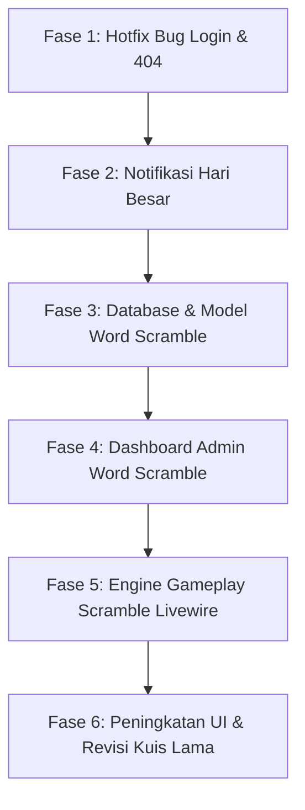

# Rencana Implementasi Terstruktur: Fitur Baru, Bug Fix & Revisi

Dokumen ini menjelaskan urutan langkah kerja terperinci yang mencakup database, model, controller, komponen Livewire, dan integrasi UI untuk projek **`terjemah_gambar`**.

## Alur Pengerjaan (Urutan Logis)



---

## Rincian Teknis & Rencana Perubahan File

### FASE 1: Hotfix Bug Login & 404

#### 1. Perbaikan Bug Login Instan
* **File:** [RedirectIfAuthenticated.php](file:///C:/laragon/www/terjemah_gambar/app/Http/Middleware/RedirectIfAuthenticated.php)
* **Tindakan:** Hapus `dd($role);` pada baris ke-23 agar admin dan user dapat masuk ke dashboard tanpa di-blokir oleh dump debug.

#### 2. Merapikan Middleware Routing
* **File:** [web.php](file:///C:/laragon/www/terjemah_gambar/routes/web.php)
* **Tindakan:** Pastikan rute yang membutuhkan login dibungkus dalam middleware `auth` sebelum memanggil check role, untuk mencegah error 404 / 403 saat session habis.

---

### FASE 2: Fitur Notifikasi Hari Besar (Homepage)

#### 1. Migrasi Database Notifikasi
* **File Baru:** `database/migrations/xxxx_xx_xx_create_holiday_notifications_table.php`
* **Skema:**
  ```php
  Schema::create('holiday_notifications', function (Blueprint $table) {
      $table->id();
      $table->string('name'); // Nama hari besar (contoh: "Hari Raya Idul Fitri")
      $table->date('start_date'); // Tanggal mulai tayang
      $table->date('end_date'); // Tanggal akhir tayang
      $table->string('icon_type'); // Jenis ikon (ketupat, merdeka, bintang, dll)
      $table->integer('display_duration')->default(5); // Durasi tampil (detik)
      $table->timestamps();
  });
  ```

#### 2. Model & Admin Controller
* **File Baru:** `app/Models/HolidayNotification.php`
* **File Baru:** `app/Http/Controllers/Dashboard/HolidayNotificationController.php` (Pengelolaan CRUD untuk admin).
* **View Baru:** `resources/views/admin/holiday/index.blade.php` (Form admin untuk set tanggal & ikon).

#### 3. Tampilan Homepage (Autohide 5 Detik)
* **File:** [welcome.blade.php](file:///C:/laragon/www/terjemah_gambar/resources/views/welcome.blade.php)
* **Tindakan:** Load notifikasi yang aktif hari ini. Jika ada, tampilkan overlay animasi ikon menggunakan Tailwind/CSS & JS dengan timer `setTimeout` untuk sembunyikan otomatis dalam 5 detik.

---

### FASE 3: Database & Model Game Word Scramble [SELESAI]

#### 1. Migrasi Kata & Detail Pop Up
* **File:** [2026_06_04_225556_create_scramble_words_table.php](file:///c:/laragon/www/terjemah_gambar/database/migrations/2026_06_04_225556_create_scramble_words_table.php)
* **Status:** Selesai migrasi.

#### 2. Migrasi Pengaturan Global (Background & Musik Latar)
* **File:** [2026_06_04_225822_create_scramble_settings_table.php](file:///c:/laragon/www/terjemah_gambar/database/migrations/2026_06_04_225822_create_scramble_settings_table.php)
* **Status:** Selesai migrasi.

#### 3. Migrasi Riwayat Permainan (Score & Unlock Player)
* **File:** [2026_06_04_225855_create_scramble_attempts_table.php](file:///c:/laragon/www/terjemah_gambar/database/migrations/2026_06_04_225855_create_scramble_attempts_table.php)
* **Status:** Selesai migrasi.

#### 4. Model Terkait
* **Files:** [ScrambleWord.php](file:///c:/laragon/www/terjemah_gambar/app/Models/ScrambleWord.php), [ScrambleSetting.php](file:///c:/laragon/www/terjemah_gambar/app/Models/ScrambleSetting.php), [ScrambleAttempt.php](file:///c:/laragon/www/terjemah_gambar/app/Models/ScrambleAttempt.php).
* **Status:** Selesai dibuat.

---

### FASE 4: Pengelolaan Admin untuk Word Scramble [SEDANG BERJALAN]

#### 1. Controller CRUD Word Scramble
* **File:** [WordScrambleController.php](file:///c:/laragon/www/terjemah_gambar/app/Http/Controllers/Game/WordScrambleController.php)
* **Metode yang Ditambahkan:**
  * `index(Request $request)`: Menampilkan daftar kata dengan fitur pencarian dan paginasi.
  * `create()`: Form tambah kata baru.
  * `store(Request $request)`: Validasi & simpan kata baru, termasuk unggah gambar ilustrasi lahan basah (`illustration_image`).
  * `edit($id)`: Form edit kata.
  * `update(Request $request, $id)`: Validasi & perbarui kata, termasuk update/unggah gambar ilustrasi.
  * `destroy($id)`: Menghapus kata.
  * `editSettings()`: Menampilkan halaman pengaturan audio, latar belakang wetland, dan target unlock level.
  * `updateSettings(Request $request)`: Menyimpan/mengubah file background musik (.mp3), background image (lahan basah), timer durasi, dan minimal skor unlock level.

#### 2. Tampilan View Admin
* **View Baru:**
  * `resources/views/admin/scramble/index.blade.php`: Halaman utama daftar kata scramble dengan tabel, pencarian, tombol tambah, edit, hapus.
  * `resources/views/admin/scramble/create.blade.php` & `resources/views/admin/scramble/edit.blade.php`: Halaman form tambah & edit kata.
  * `resources/views/admin/scramble/settings.blade.php`: Halaman konfigurasi global permainan (musik, gambar, timer, target unlock).

---

### FASE 5: Pembuatan Game Word Scramble (Livewire) [SEBAGIAN SELESAI]

#### 1. Komponen Livewire Gameplay
* **File Baru:** [ScramblePlay.php](file:///c:/laragon/www/terjemah_gambar/app/Http/Livewire/ScramblePlay.php)
* **Status Implementasi:**
  * **Acak Huruf (Scrambling)**: Selesai. Karakter kata diacak secara dinamis jika tidak ditentukan di database.
  * **Sistem Level Unlock**: Selesai. Total skor pemain divalidasi dengan pengaturan batas minimal unlock dari admin untuk membuka Level 2 & 3.
  * **Pop-Up Detail**: Selesai. Menampilkan deskripsi ilmiah lengkap beserta gambar ilustrasi lahan basah jika kata berhasil ditebak.
  * **Audio & Background**: Selesai. Pemuatan background wetland dinamis dan audio musik otomatis sesuai pengaturan admin.
  * **3 Mode Logika**: [DITUNDA] Ditunda sementara sesuai instruksi user agar pengembangan terfokus pada gameplay inti yang stabil terlebih dahulu.

#### 2. View Game Board
* **File Baru:** [scramble-play.blade.php](file:///c:/laragon/www/terjemah_gambar/resources/views/livewire/scramble-play.blade.php)
* **Visual:** Desain glassmorphic premium responsif, diletakkan di atas background Wetland dinamis dengan visual timer progres menyusut.

---

### FASE 6: Peningkatan UI & Revisi Kuis Lama

#### 1. Tampilkan Jawaban Benar & Navigasi Bagan Soal
* **File:** [quizplay.blade.php](file:///C:/laragon/www/terjemah_gambar/resources/views/livewire/quizplay.blade.php) & [Quizplay.php](file:///C:/laragon/www/terjemah_gambar/app/Http/Livewire/Quizplay.php)
* **Peningkatan:**
  * Menampilkan bagan nomor soal (grid box) di samping/atas kuis. Nomor yang sudah dijawab berwarna hijau, yang belum berwarna abu-abu. Bisa di-klik untuk pindah soal secara cepat.
  * Jika user menjawab salah pada tipe pilihan ganda/isian, sistem langsung memunculkan tanda silang merah beserta teks jawaban yang benar.

#### 2. Riwayat Nilai & Motivasi Estetik
* **File:** [dashboard_user.blade.php](file:///C:/laragon/www/terjemah_gambar/resources/views/participant/dashboard_user.blade.php)
* **Peningkatan:**
  * Integrasi quotes motivasi harian dengan background visual menarik.
  * Halaman leaderboard top score yang didesain lebih jelas dan modern.

---

## Rencana Verifikasi

1. **Jalankan Migrasi Baru & Seeder**: `php artisan migrate` untuk memastikan semua tabel terbuat sempurna.
2. **Uji Fungsional Admin**: Menambah kata scramble baru, mengunggah audio & gambar, dan mengubah pengaturan timer.
3. **Uji Fungsional Game**:
   * Membuka game Scramble di mode vs Komputer, vs User, dan Multiplayer.
   * Memastikan musik berbunyi dan background wetland berubah sesuai input admin.
   * Memastikan popup informasi kata tampil saat kata berhasil dijawab benar.
   * Memastikan level ter-kunci (locked) jika target minimal pengerjaan belum tercapai.
